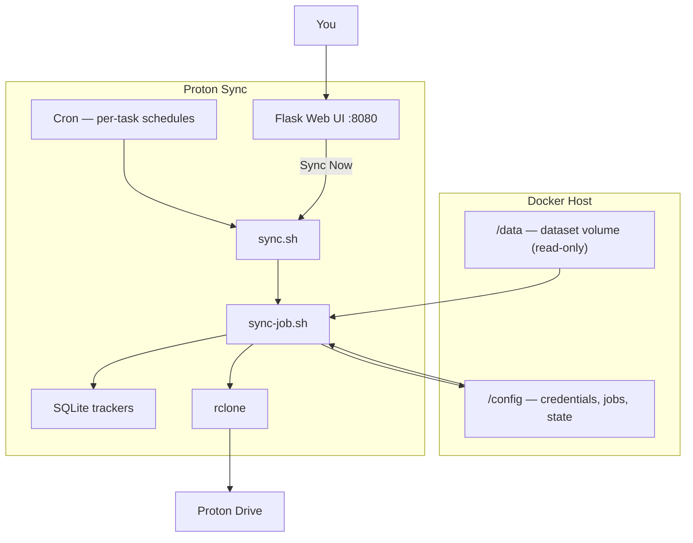

# Proton Sync

A self-contained Docker app that backs up local datasets to [Proton Drive](https://proton.me/drive), managed through a web UI. Built for TrueNAS and other Docker hosts.

**Container image:** `ghcr.io/xman601/proton-sync:latest`

## Features

- **Incremental sync** — SQLite file tracking uploads only new/changed files
- **Folder tracking** — removes renamed/deleted folders on Proton Drive
- **Web UI** — Proton auth, backup tasks, schedules, logs, and stats
- **Per-task schedules** — cron per backup path, or manual sync from the dashboard
- **Dashboard** — sync status, live progress, and task controls
- **Stats** — storage footprint, daily activity, and trend charts
- **Config backup** — export/import a zip of credentials, jobs, and sync state
- **Optional UI login** — password-protect the web interface

## Quick start

### 1. Copy the example files

```bash
cp example.docker-compose.yml docker-compose.yml
cp example.env .env
```

Edit **`docker-compose.yml`** — set your host paths:

```yaml
volumes:
  - /path/to/your/dataset:/data:ro
  - /path/to/your/config:/config
```

Edit **`.env`** — set timezone and UI credentials (see [Environment variables](#environment-variables)).

### 2. Start the container

```bash
docker compose pull
docker compose up -d
```

To **build locally** instead of pulling from GHCR, comment out `image` and uncomment `build: .` in `docker-compose.yml`, then run `docker compose up -d --build`.

### 3. Open the UI

Go to `http://<host-ip>:8080` and sign in.

Leave `UI_PASSWORD` empty in `.env` to disable authentication (not recommended on untrusted networks).

### 4. Set up backups

1. **Settings** → connect Proton Drive
2. **Settings** → configure default paths (if not locked in compose)
3. **Backup Paths** → add source → Proton Drive folder mappings
4. **Schedule** → set a cron per task, or use **Sync Now** on the dashboard

## UI overview

| Page | Purpose |
|------|---------|
| **Dashboard** | Health, last sync, live sync progress, backup tasks |
| **Stats** | Files/folders/storage totals, trends, per-task breakdown |
| **Backup Paths** | Browse source data and manage backup tasks |
| **Schedule** | Per-task cron schedules |
| **Logs** | Sync run history |
| **Settings** | Default paths, Proton auth, config backup/restore |

## Environment variables

Copy `example.env` to `.env`. Compose substitutes `${VAR}` automatically.

| Variable | Required | Default | Description |
|----------|----------|---------|-------------|
| `TZ` | No | `UTC` | Timezone for logs, cron, and daily stats |
| `UI_USERNAME` | No | `admin` | Web UI username |
| `UI_PASSWORD` | No | *(empty)* | Web UI password; empty disables auth |
| `PROTON_SYNC_PATHS_LOCKED` | No | — | Set to `1` with paths below to lock via compose |
| `SOURCE_DIR` | No | `/data` | Container source root (Settings UI if unlocked) |
| `REMOTE_PATH` | No | `protondrive:NAS-Backup` | Proton Drive root folder |
| `SECRET_KEY` | No | auto-generated | Flask session signing key |

To lock paths in compose, uncomment the optional lines in both `.env` and `docker-compose.yml`.

## Multiple backup paths

Mount folders under `/data`, then add a task per folder in the UI:

```yaml
volumes:
  - /path/to/photos:/data/photos:ro
  - /path/to/documents:/data/documents:ro
  - /path/to/your/config:/config
```

Example tasks:

- `/data/photos` → `My-Backup/photos`
- `/data/documents` → `My-Backup/documents`

Each task has its own schedule, tracker DB, and stats.

## Config backup & restore

**Settings → Config Backup** exports a zip with credentials, jobs, SQLite trackers, and sync state. Logs are not included.

| Method | When to use |
|--------|-------------|
| **Download zip** | Periodic off-site backup |
| **Restore from file** | Replace config while running |
| **`backup.zip` in `/config`** | Auto-import on startup when config is empty |

### Disaster recovery

1. Recreate the config dataset and mount it to `/config`
2. Place a saved zip as `/config/backup.zip`
3. Start the container — config restores automatically

## Workflow



## Updating

```bash
docker compose pull
docker compose up -d
```

Credentials and sync state in `/config` are preserved.

## Sync algorithm

Based on the community approach by [weekends-rule](https://forums.truenas.com/t/more-efficient-one-way-up-sync-from-truenas-to-proton-drive/31121):

1. Scan source files into SQLite
2. Diff against the last snapshot
3. Upload changes via `rclone sync --files-from`
4. Delete removed files on Proton Drive
5. Clean up empty/renamed folders

Unchanged datasets finish in seconds regardless of total size.

## File layout

```
/data/                  → mounted dataset (read-only)
/config/
  rclone.conf           → Proton credentials
  jobs.json             → backup tasks
  overrides.env         → path settings from UI (optional)
  stats/history.jsonl   → chart history
  db/{job_id}/          → per-task SQLite trackers
  logs/                 → sync and cron logs
```

## Notes

- Source data is mounted **read-only** — this app never modifies your files
- Credentials are stored in rclone's obscured format in `/config/rclone.conf`
- Noisy Proton API 422 "already exists" messages are filtered from logs

## License

[MIT](LICENSE) — Copyright (c) 2026 xman601
